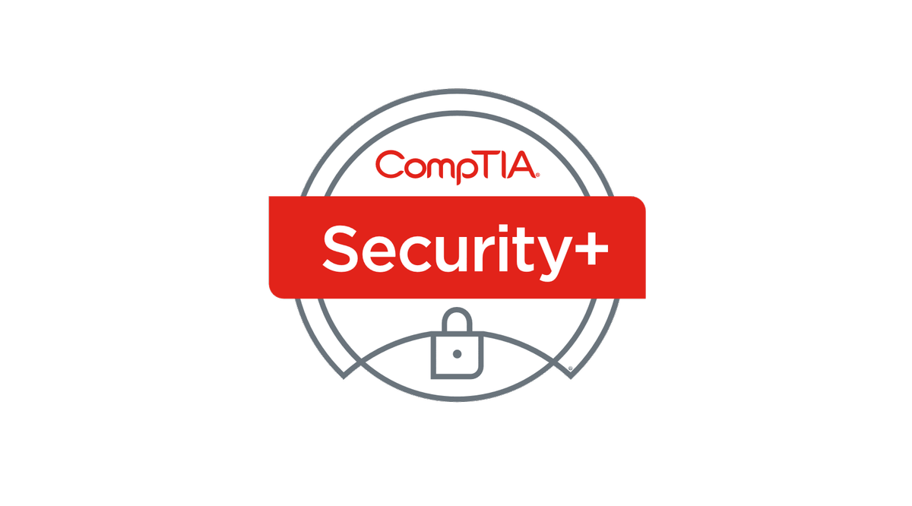

After failing my driving test in November 2020 and being unable to take more lessons due to the COVID lockdown I wanted something I could strive towards and attain in the time I found myself isolated. On a hunch I looked up the CompTIA Security+ certification that I regularly saw mentioned in online InfoSec spaces. To my surprise I found a video course from Total Seminars on sale on Udemy, and decided to take the plunge. Rather conveniently I then received Jury duty (it is quite ironic I had it within my first 6 months working full time during my industry placement year while some never have it all). So... sat on the bus marinating in my driving test failure every day for two weeks on a two hour daily round trip - on freezing winter mornings (with the windows open because of COVID) I watched the videos.  

By the end of my duty, I had completed the course, and the Security+ felt much more attainable to me. I tried some practice tests and quickly found I needed some more help. But with Black Friday/Cyber Monday on approach, I yet again found myself at the mercy of a sale, and bought the Security+ 501 exam voucher, alongside the official study guide. Every day after work I painstakingly took notes into my virtual flash cards which had carried me through GCSEs, A-Levels and University exams. I would later purchase 2000 practice questions from Total Seminars, and after finishing the study guide, began practicing with quickfire rounds of questions, with high thresholds designed to make me fail as much as possible. I knew how tight the grade boundaries were and with my inexperience I had to practice till I could get 90% consistently with new questions. 

 

I took three full length practice tests and passed all three, which was when I finally decided to take the plunge and book my exam. I booked half a day off work and set to work, revising and practicing over and over and over again. 

 

The day finally came... exam day. To say I was nervous was an understatement, usually exams only had the existential concept of failure looming over me, but this time it was £400 of my own money and 3 months of my own time which is a much more material cost of failure, especially when you’re a student.  

 

I booted up the exam, showed the examiner that there were no cheeky notes under my mouse pad and began. The exam questions were just as difficult as those in the practice, the performance-based questions especially so, where you were given diagrams or interfaces and had to perform the correct action on them. The hour and a half sped by, with 5 minutes to spare I finished, quadruple checked every answer having to argue between my gut and my overthinking brain if my answer was what the question was truly asking. 

In the end I hit submit, and by some miracle passed with a score of 790 points.  

The conclusion to draw is that perseverance and a good study plan can pay off and boost you further than you expect, and now - I have to look forward to doing it all again in two years... 