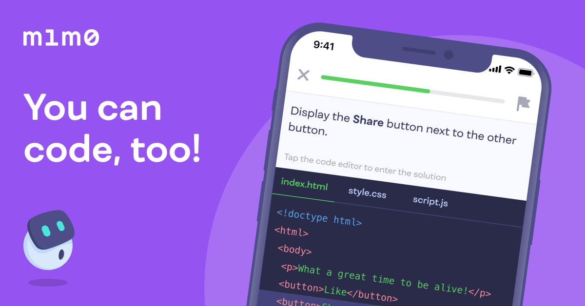
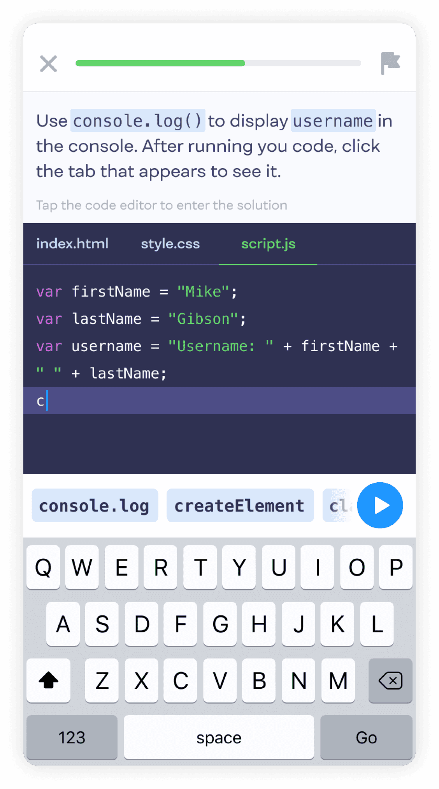

Mimo Web Development Path Review 

 

Mimo is a mobile app-based learning app, like Duolingo if you have ever given that a try. Based on short amounts of learning every day, over a long period of time. Earlier this year I took the plunge and spent £50 on Mimo premium to get access to the full web development and python courses (the only currently available). This week I finally completed the web development course, which at a pace of 1 5-minute lesson before work every day has taken me 6 months.  

Mimo offers a number of question types, such as True/False statements, questions and answers, find the bug, complete the code and full code writing sessions. 

The web development course is nicely split apart to ease you into it if you are new to web development (which I am, I’ve done a lot of backend but front-end is an area I feel I had been lacking, hence the course). We start off with HTML, covering our basic HTML tags, image, headers, links, text, buttons, lists you name it. I was also impressed by Mimo’s focus on teaching to write HTML in an accessible manner, using tags such as [name of tag] so that applications like a screen reader can accurately convey information for those who may need a screen reader. 

Next up we move onto styles with CSS, covering our box models, colours, classes, inheritance and functions. I found CSS a steeper learning curve than HTML, perhaps because CSS was alien to me, as designing web pages is not something I had not done before, but I felt that Mimo gave me a strong foundation to further my understanding of CSS when the need may arise on the job.  

Next up JavaScript, which couldn’t have come at a better time as I found myself working on TypeScript at work. Here I found that the Mimo course directly assisted me in improving the TypeScript I wrote at work by teaching me JavaScript (TypeScript is essentially JavaScript with types to give developers an easier time debugging for those who may not know). I found the courses on Object Oriented Program especially helpful, as previously during my Cyber Security Course we had mainly been taught Functional Programming and OOP has been something I rarely touched. But Mimo finally gave me the confidence to start incorporating OOP at a deeper level into my code, resulting in my code running faster, and becoming significantly more readable.  

The JavaScript course continues into frameworks, specifically React.js. I found the React course was not as helpful as the previous three, the React course teaches various elements of React such as hooks, events, states and rendering. But I felt the course did not adequately explain when the best times to use these various elements of React are and seemed to jump up and down in difficulty from lesson to lesson. So, if you are looking to Mimo specifically to learn React, perhaps look elsewhere. But if you are like me seeking to improve your overall skills then a foundation on the elements of React.js is still helpful, but I felt there could have been more information provided. 

Next Mimo covers Version Control with git, covering all the basics such as commits, pushing, checkouts,but does not go into further detail to cover more advanced features such as rebase.  

 

Finally, Mimo’s web development course covers SQL, which I already had a lot of experience with so this review may not be the reflection of someone going in blind. But I felt the SQL was covered well, and adequately helped to explain various basic concepts of SQL simply, while moving smoothly on to more advanced elements of SQL, such as the varying types of joins and when to use them, SQL Functions, SQL Aliases, Unions/Intersections/Differences and wildcards. 

 

Overall, I find Mimo’s method of learning is excellent, just like how Duolingo makes it easy to learn spoken languages with short burst lessons over long periods, Mimo does the same for programming languages. I found learning over a longer period of time especially helps when it comes to retaining your knowledge as long term memory, and I will be continuing my usage of Mimo into the Python course, so expect a review of that too in six months' time. I feel that Mimo premium ultimately was worth the price of admission (and can be paid monthly rather than as a £50 lump sum like I did). So, if you are looking to improve your web development skills in a manner that doesn’t intrude on your time then I would absolutely recommend Mimo.  