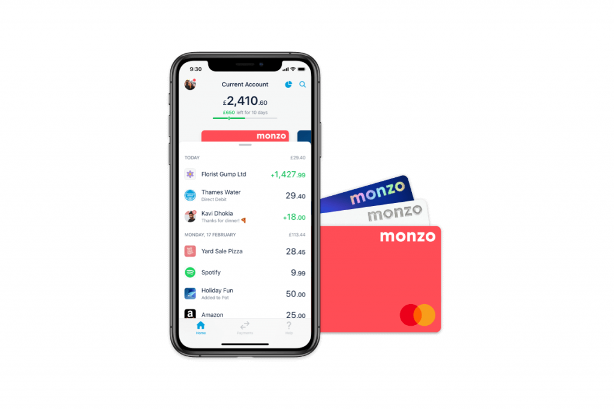
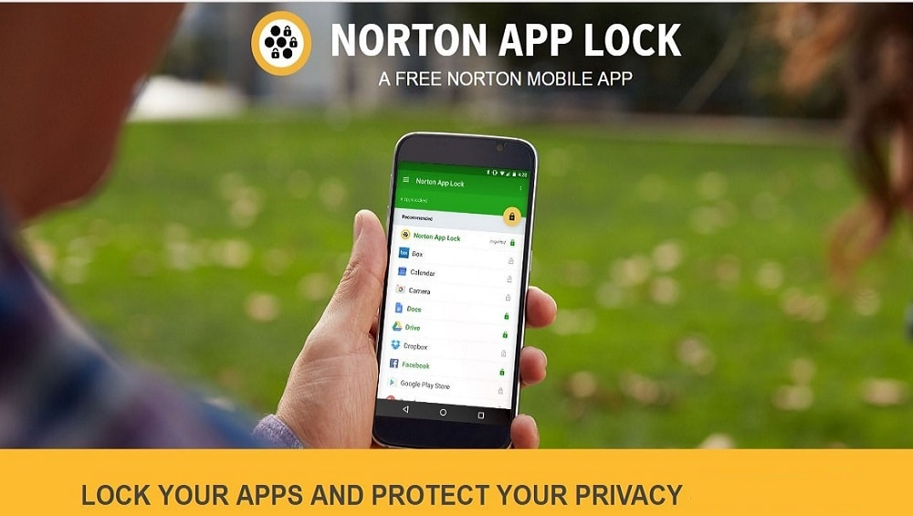

Today I was browsing as usual, when I came across a terrifying thread. Someone talking about being mugged in London, a scary enough experience, but with a twist. The individual was forced to hand over the pin for their numbers for cards, and the password to their phone. Giving the attackers access to pretty much anything on the phone that didn’t have extra layers of security. 

## I want you to think for a minute, what is on your phone? 

I can tell you what I had on mine. Social Media accounts, Emails, Multi Factor Authentication Apps for personal and work use, my notes app which is regularly used for storing the array of multi-digit numbers we are supposed to remember off by heart and never forget, Chrome and its built-in password manager, which if you’ve used it you know you only need the device’s password to access. On one device, secured by one password.  

You can see how quickly things can unravel. And imagine that I wasn’t someone in Cyber Security, perhaps my bank account apps (the few I have, only because I am forced to have them or not be able to use the corresponding accounts).  

Now imagine this scenario... Partially based on the events of the post taking place in an area I have passed through many times before. 

You’re seeing your favourite band play at the O2 Arena in London, you’ve had a little to drink but you aren’t tipsy so driving is not an option. You leave at the same time as everyone else at the concert... but the queue to get the tube is so long it stretches from North Greenwich Station to the doors of the O2 Arena... So, you get the bus, planning to hop onto the tube further down the line where the bus line and tube next intersect. You get off your bus and make the short walk through a strange area of East London. Except this time instead of getting to the well-lit relative safety of the tube station, two men in balaclavas step out in front of you with knives. Then two more out of an alley way behind you.  

They don’t just want your phone, your cash, your card. They want your phones password, your pin numbers, your ID. Everything you have on you and the keys to it all.  

And just to be sure now you’re forced to watch as they try each password out to make sure it’s the correct one. Before beating you and leaving you in a gutter. 

Fast forward a week after recovering from your beating in hospital, now it’s time to get your life back together. Except oh no, your phones gone... Can’t use MFA secured accounts, can’t ring anyone to cancel anything. But it’s okay, you were smart enough to keep your backup codes in your notes app. But now there’s another issue, they got into your Google/Apple account too. Everything is gone, your pictures, notes, files, emails. They’ve gotten into your password manager and targeted important accounts to lock you out - while they enjoy their trauma funded spending spree on your tab. But wait, it’s worse. They’ve passed your details and accounts out to other associates. Now every social media account you own is peddling crypto currency scams on your name, your identity details have been passed to fraudsters who are setting up cards in your name and trashing your credit score.
## Where would you even start? 

No money, no accounts, no transport. A starting point would be your fellow human being, try and scrounge some money or phone calls that you can use to verify your identity and cancel your bank cards first and foremost. After that it’s all relying on regaining access to your email and being at the mercy of customer service representatives for your remaining endeavours. 

## So, what can you do to prevent this nightmare scenario? Here’s a few things I’ve picked up. 

1. If you don’t need a banking app on your phone, don’t have it. So Monzo users are out of luck here - as you can’t access your account without the app. But try and keep things away from your weakest point, this being your phone. 

2. Further to this, if you do have a banking app on your phone, ensure it is locked with a pin SEPERATE to your phone or bank passwords, most banking apps will have this as a feature in your security settings. 

3. Setup a recovery email and recovery phone. Get a free SIM and if you’ve got an old phone kicking around use the SIM with that phone as a backup recovery phone (useful for alternative accounts too!) Google has options for recovery phones & emails which can regain access to your accounts. While Apple has rescue email. 

4. Keep some emergency money, be it in cash or a bank account who’s card you leave at home. 

5. Diversify your bank accounts across multiple vendors. Try to avoid having too much in any particular pot, this is also helpful in the event of bank failures or fraud, so you won’t be burned too badly if your eggs are all in one basket. Think Bank account Y for household bills, bank account Z for fun spending, bank account X for saving up for a new car.  

6. Keep secured backups of your essential accounts, Google have a service called Google Takeout which can back up your entire account, files, photos, emails, notes. Apple also allow you to download your data. 

7. Consider using any security features your phone natively has, such as Samsung’s Secure Folder to keep especially important things, such as Authenticators and Bank apps even further inaccessible (and hope your attackers have left before they try to access it).  

8. Ensure you have find my phone and remote wiping setup and ready to use from another device such as a laptop or tablet. While find my phone likely won’t be of much help unless you’re John Wick, remote wiping could be a life saver in this scenario if they haven't already forced you to disable this.  

9. Use a cloud backed-up MFA provider such as Microsoft Authenticator or Authy, and ensure the cloud backups are enabled.  

10. Lock apps that could be targets. You’ll be sacrificing some convenience here. Email, banking & MFA Apps may be particular targets to attackers, consider either a built-in app lock or a third-party lock (from a reputable source) such as Kaspersky (paid) or Norton App Lock (Free).  

11. Setup a SIM Card Lock and encrypt your phone if you can. This may not help if you’re being forced to hand over the credentials but is a useful addition, nonetheless. Likewise set your text messages to not be visible on the lock screen.

Hopefully a day will never arise when you need to truly use these recovery tips & tools. But 20 minutes now could save you days or weeks of stress in the future. 

 